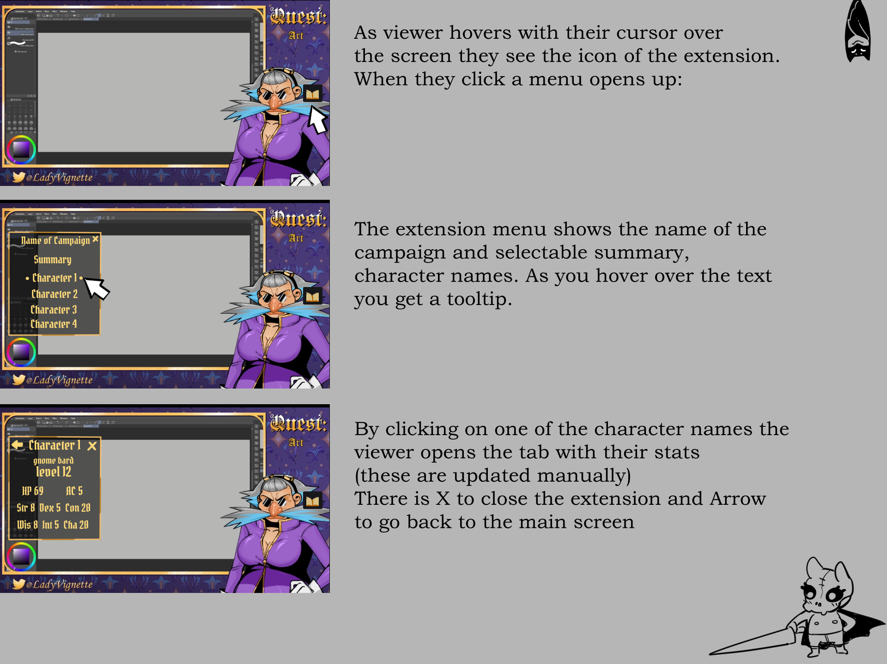

# Lady V's Twitch Overlay

## Goal

A twitch overlay for Lady V's D&D streams that shows an interactive plate for viewers of the stream during games.

* Icon on the stream that can be clicked to open the window
* Contents of the window
  * Name of campaign
  * Link to Summary
    * What's in here? Just text?
  * Link to Character (multiple)
    * Character name
    * Race+class
    * Level
    * Max HP and AC
    * Str, Dex, Con, Wis, Int, Cha

### Stretch Goals

* Genericise it so anyone can use it

# Starting up

## Prepare

* Download and install docker
* Run docker
* Create a twitch extension with:
  * Type: Video overlay
  * Base url: https://localhost/
  * Config url: config.html
  * Overlay url: video_overlay.html
* Download and install OBS (or use your favourite streaming software)

## Testing

* Generate a crt/key certificate pair for the nginx server under `conf/certs`
  * `sudo openssl req -x509 -nodes -days 365 -newkey rsa:2048 -keyout conf/certs/nginx.key -out conf/certs/nginx.crt`
* Run `docker-compose up --build`
  * This starts a local web server, with the same address as the Twitch overlay
* Start a stream in your streaming software
  * You need to have a running stream for the overlay to run
* Interact

## Production release

* zip all the files under `src/` to a zip file
  * Note: there's a [task](https://taskfile.dev) script that zips this for you, putting the contents in the `deploy/` folder.
* Upload that zip file to Twitch using the `https://dev.twitch.tv/console/extensions/[ext]/[version]/status` window for uploading files
* Submit for review and wait.

## Usage

# Todo

* [x] Basic test of overlay runs
* [x] Config
  * [ ] Pick a layout
  * [x] Add characters (details)
* [x] Display
  * [x] Summary
  * [x] Clicking a character shows their stats
  * [x] Back and close navigation
* [x] Code tidying
  * [x] Character as an Object
* [x] Live updating via send/listen
* [x] Fix padding on box
* [x] Icon fixes
  * [x] Make icon resize with display
  * [x] Move to bottom right
  * [x] Make it pop in and out of stream when you hover over the iframe
* [ ] Live updates of characters doesn't work.
  * [ ] Individual characters and stats

# References

* [Example extension using saved config](https://github.com/twitchdev/bot-commander)